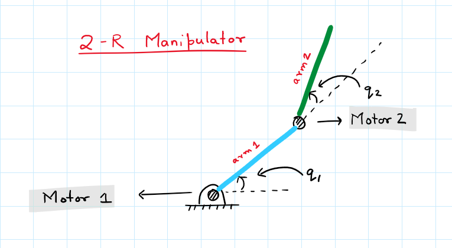
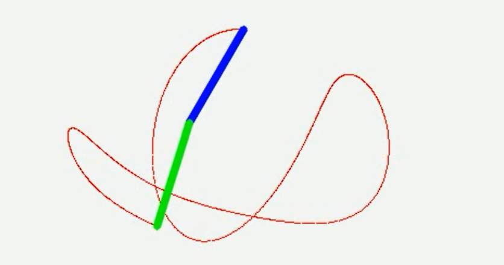

# Control-Theory Problem Statement
Our aim is to do real time Robot control and tracking. Consider the following scenario.

We designed a robot to move in a straight direction. But due to uneven gound it starts to drift away from the straight line. What should we do then? How to make a robot smart enough so that it can comes back to its position? 

In real world scenarios, there are always small perturbations that might push away the robot from its desired trajectory. And this motivates us to have an auto corrective control in the robot that can guide itself back. 

Haha, but the main question is: **What is this smart auto control strategy?**

And this is what this project is all about. Figuring out a simple control mechanism. (Note that this project is **not implementationally heavy**, almost all the code for simulation is already written, you just have to figure out the control strategy).

## Our Robot: 2R Manipulator
<div align="center">


</div>

We are selecting a 2R manipulator. It has 2 arms of equal length, mass, density. The arms are connected using 2 revolute joints. There are motors at each joint to allow us to move the robot according to our wish. 

`q1` and `q2` are the respective angles that are made by the arms. 

**Note:** `q2` is **not** measured from the horizontal x axis

> We will be simulating the above robot in real world conditions. This means that gravity will be acting on the rods downwards.


## The problem Statements

We have three different problem statements.

### **1. PS1: Stand Still**
The aim is to make the robot vertically straight against the gravity.

q1 = π/2

q2 = 0

### **2. PS2: Extended Circle**
The aim to make the end point of `arm2` to track a circle with the whole robot extended (`arm1` and `arm2` always parallel)

q1 = 2πt

q2 = 0

### **3. PS3: Verticle Circle**
The aim to make `arm1` make a full revolution but `arm2` should remain in vertical orientation throughout the process

q1 = 2πt

q2 = π/2 - 2πt = π/2 - q1


>Although all these problem statements might look different, but what's magical is that they all can be solved using a single auto corrective controller (Which you have to design).

## Installation and Getting Started

1. Clone the repository.

People using windows may want to use git bash (from [here](https://www.stanleyulili.com/git/how-to-install-git-bash-on-windows/)) or GitHub Desktop (from [here](https://desktop.github.com/)).

GitHub Desktop is easier for beginners but if you want to learn git anyways try git bash.

Others open their shell / cmd/ terminal run
```Shell
$ git clone https://github.com/neelabh17/Control-Theory-Simulator.git
$ cd Control-Theory-Simulator
```   

2. Set up the python(3.7) environment. I prefer miniconda (Kindly download from [here](https://docs.conda.io/en/latest/miniconda.html)). Given below is how to create a conda environment by the name `robo-ct`
```Shell
$ conda create -n robo-ct python=3.7
$ conda activate robo-ct
```   
Make sure you are always inside the `robo-ct` environment while working with this project 

3. Install dependencies. (You might want to select your virtual environment first using the command `conda activate robo-ct`)
```Shell
$ pip install -r requirements.txt
```    

## Running
The **only** file that you can edit is `control.py`. It contains a single function `controller` with 6 input arguments:

* `q1` : angle of the first arm
* `q2` : angle of the second arm
* `w1` : angular velocity of the first arm
* `w2` : angular velocity of the second arm
* `q1_desired` : desired angle of the first arm
* `q2_desired` : desired angle of the second arm

The motors movement is determined by the torque provided. Your task is to give what should be the values of the torques `t1` and `t2` for the desired result. This known as designing the controller.

Save the file and run the following command to let a simulation output of your controller. 

```Shell
$ python run.py
```    

This will generate 3 video files that contain the simulation results.
* `PS1_stand_still.avi`
* `PS2_extended_circle.avi` 
* `PS3_vertical_circle.avi` 


> If you run the command without making any changes in `control.py`  then the simulation will be the same as that of a double pendulumn as `t1` and `t2` are returned as 0 by default.

<div align="center">


</div>


## Authors
* [*Neelabh Madan*](https://github.com/neelabh17)


## Updates

* **Version 0.1**: Basic simulation on 2R manipulator 


## License
Copyright 2020 Robotics Club, IITD.  All rights reserved.
No part of the presentation/code may be reproduced or copied in any form or by any means [graphic, electronic or mechanical, including photocopying, recording, taping or information retrieval systems] or reproduced on any disc, tape, perforated media or other information storage device, etc., without the explicit written permission of the IIT Delhi. Breach of the condition is liable for legal action. Authorization to reproduce such material must be obtained from the copyright holders concerned. 
